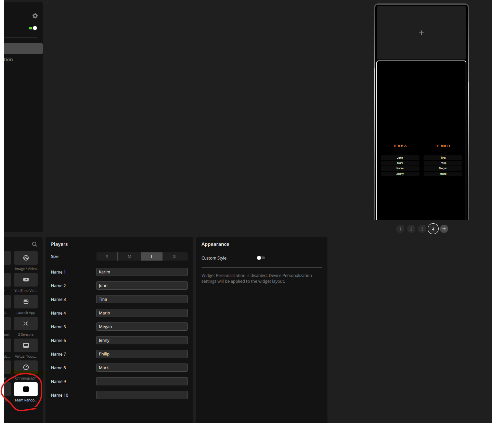

🧩 XENEON EDGE – Team Randomizer Widget

A custom interactive widget for Corsair iCUE / XENEON EDGE that lets you quickly split up to 10 players into two random teams with a simple shuffle button.

Demo:
## 📸 Preview

## 🎬 Demo

[Watch Demo](assets/demo.mp4)

🎯 Purpose

This widget is designed for:

quick team generation (e.g. gaming sessions, football, LAN parties)
fair random distribution of players
a clean and visual way to reshuffle teams instantly

Instead of manually assigning teams, you can simply:

enter names
press Shuffle
get two balanced random teams
⚙️ Features
supports up to 10 players
splits automatically into Team A / Team B
interactive Shuffle button
customizable:
team labels
colors
background
smooth shuffle animation
multi-language support via translation file
📁 File Structure

Place the files directly inside the iCUE widgets folder (not in a subfolder):

widgets/
├── TeamRandomizer.html
├── TeamRandomizer_translation.json
└── images/
    └── team-randomizer.svg
📍 How to Install
1. Locate iCUE widgets folder

Default path on Windows:

C:\Program Files\Corsair\Corsair iCUE5 Software\widgets\

If you installed iCUE somewhere else:

search for: iCUE5
then navigate to the widgets directory
2. Copy files

Copy the following into the widgets folder:

TeamRandomizer.html
TeamRandomizer_translation.json
images/team-randomizer.svg
3. Restart iCUE

Important:

completely close iCUE
reopen it

(iCUE does not hot-reload widgets)

4. Add the widget
open iCUE
go to your XENEON EDGE
add a new widget
select Team Randomizer
🧪 Usage
Open widget settings
Enter player names (up to 10)
Tap Shuffle
Teams are generated instantly